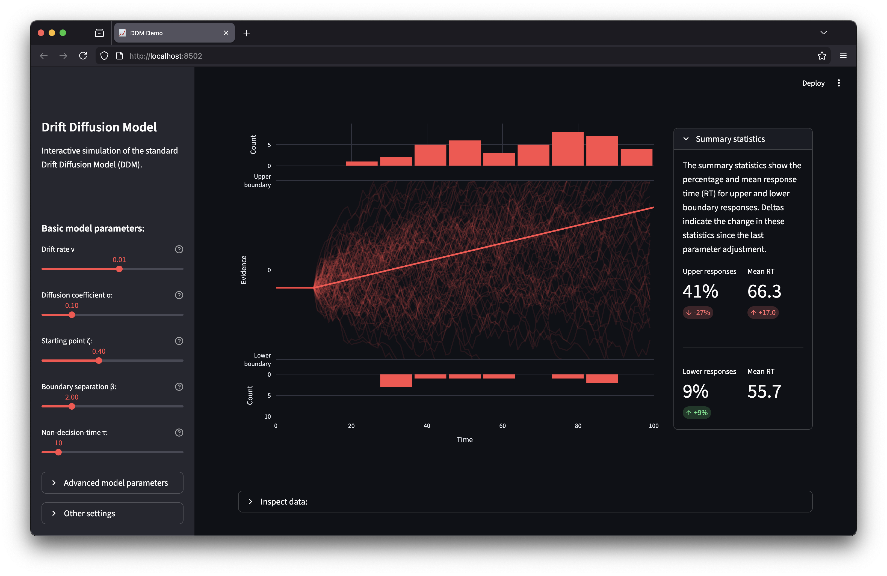

# Drift Diffusion Model Demo

[](https://ddm-interactive.streamlit.app)

Interactive visualization of the Drift Diffusion Model (DDM) - a sequential sampling model for two-choice decision making.

## Reference

Ratcliff, R. (1978). A theory of memory retrieval. *Psychological Review*, 85(2), 59-108.

## Run locally

```bash
curl -LsSf https://astral.sh/uv/install.sh | sh  # Install uv
git clone https://github.com/moltaire/streamlit_ddm
cd streamlit_ddm
uv run streamlit run ddm_interactive.py
```
